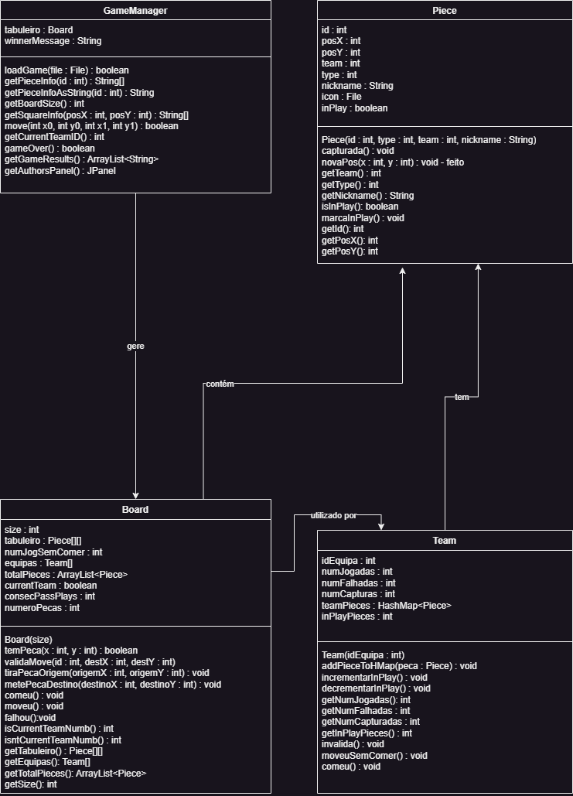

# Middle Earth Chess

O jogo de xadrez desenvolvido pelo grupo teve inspiração na saga de [J.R.R.Tolkien](https://en.wikipedia.org/wiki/J._R._R._Tolkien), O Senhor dos Anéis.

Do lado das peças pretas, joga o lado do mal onde o olho de Sauron toma a posição de Rei e,
do lado das peças brancas, temos o dito lado do bem no qual Aragorn ocupa toma também a posição de Rei.

Para tal, recorremos às seguintes imagens :

<table>
  <tr>
    <td align="center">Sauron</td>
    <td align="center">Aragorn</td>
  </tr>
  <tr>
    <td align="center"></td>
    <td align="center"></td>
  </tr>
</table>

Nas entregas seguintes esta tabela contiuará a ser preenchida com outras personagens da 
saga que corresponderam a diferentes tipos de peças.

# Diagrama UML

  

Trabalho desenvolvido por [Miguel Melo](https://github.com/miguel-melo-a21905215) (21905215) e [Gonçalo Barata](https://github.com/goncalo-barata-a22205060) (22205060)
