# Middle Earth Chess

O jogo de xadrez desenvolvido pelo nosso grupo foi inspirado na saga
de [J.R.R.Tolkien](https://pt.wikipedia.org/wiki/J._R._R._Tolkien), O Senhor dos Anéis.

Do lado das peças pretas, joga o lado do mal, onde o olho de Sauron assume a posição de Rei. No lado das peças brancas,
temos o lado do bem, no qual Aragorn também assume a posição de Rei.

Para atingir esse objetivo, utilizamos as seguintes imagens:

<table>
  <tr>
    <td align="center" colspan="2">Rei</td>
    <td align="center" colspan="2">Rainha</td>
    <td align="center" colspan="2">Padre da Vila</td>
    <td align="center" colspan="2">Pónei Mágico</td>
    <td align="center" colspan="2">Torre Horizontal</td>
    <td align="center" colspan="2">Torre Vertical</td>
    <td align="center" colspan="2">Homer Simpson</td>
    <td align="center" colspan="2">Joker</td>
    <td align="center" colspan="2">Ave Rara</td>
  </tr>
  <tr>
    <td align="center">Sauron</td>
    <td align="center">Aragorn</td>
    <td align="center">Dark Galadriel</td>
    <td align="center">Lady Galadriel</td>
    <td align="center">Saruman</td>
    <td align="center">Gandalf</td>
    <td align="center">Azog</td>
    <td align="center">Éomer</td>
    <td align="center">Mount Doom</td>
    <td align="center">Lonely Mountain</td>
    <td align="center">Eisengard</td>
    <td align="center">Minas Tirith</td>
    <td align="center">Grima </td>
    <td align="center">Gimli</td>
    <td align="center">Gollum</td>
    <td align="center">Frodo</td>
    <td align="center">Hell Hawk</td>
    <td align="center">Gwaihir</td>
  </tr>
  <tr>
    <td align="center">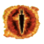</td>
    <td align="center">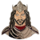</td>
    <td align="center">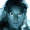</td>
    <td align="center">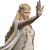</td>
    <td align="center"></td>
    <td align="center"></td>
    <td align="center">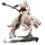</td>
    <td align="center">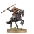</td>
    <td align="center"></td>
    <td align="center"></td>
    <td align="center">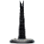</td>
    <td align="center">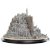</td>
    <td align="center">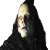</td>
    <td align="center">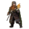</td>
    <td align="center">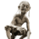</td>
    <td align="center">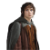</td>
    <td align="center">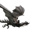</td>
    <td align="center"></td>
  </tr>
</table>


<p align="center">
  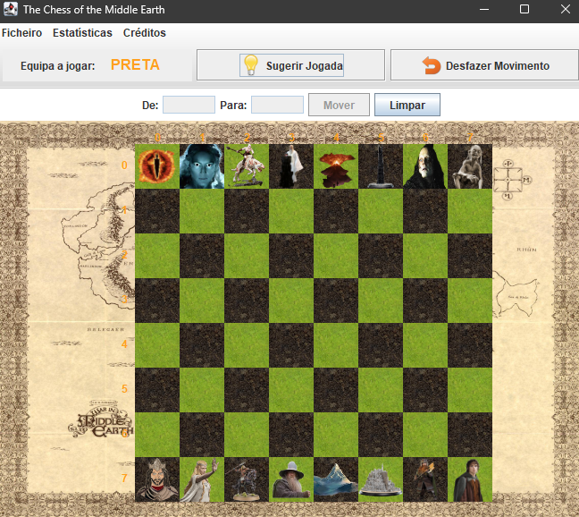
</p>

#### Vídeo explicativo: https://youtu.be/1xSWG4G5OXo

# Diagrama UML

<p align="center">
  
</p>

## Code Development

No desenvolvimento do nosso código, procuramos seguir ao máximo o princípio do encapsulamento, tornando o código
facilmente legível. Os nomes escolhidos para as funções são autoexplicativos, garantindo que seja compreensível o
propósito de cada método.

---------------------

### Class Board

Dado que todo o jogo se desenrola no tabuleiro, a classe Board é de grande importância. Nela, estão a maioria dos
métodos que complementam as funcionalidades da classe GameManager. Esta classe contém uma matriz bidimensional (de
objetos da classe `Piece`) que representa o tabuleiro. A matriz guarda as peças em suas posições correspondentes, e, no
caso de não haver uma peça, a posição terá o valor null. Também armazena a informação sobre qual equipe deve jogar por
meio de um booleano, sendo false para a equipe preta e true para a equipe branca, sendo depois retornados os respectivos
valores 0 ou 1 quando necessários nos métodos da classe `GameManager`.

---------------------

### Class Team

Nos objetos da classe `Team`, apenas guardamos informações necessárias aos métodos `gameOver()` e `getGameResults()` da
GameManager, bem como as peças referentes a cada equipe.

---------------------

### Class Piece

Na última "camada" da hierarquia, temos a classe `Piece`, implementada para que possamos criar objetos referentes a cada
peça presente no arquivo/tabuleiro e armazenar suas informações de forma acessível.

---------------------

## Chess Pieces e Moves

Na segunda parte do trabalho, focamos nos diferentes tipos de peças e suas características específicas, destacando-se o
tipo de movimento de cada uma. Abordamos a questão visando repetir o mínimo de código possível. Para isso, dividimos a
função move em duas partes:

- Geral: Onde verificamos as condições comuns a qualquer movimento de qualquer peça.

- Específico: Onde são feitas as verificações do movimento que cada peça pode realizar, bem como particularidades, como
  o
  protocolo da Rainha, que não pode ser capturada por uma peça do mesmo tipo.

As verificações do precursor também são feitas com o uso de funções pertencentes à classe "pai", uma vez que várias
peças têm movimentos baseados na mesma lógica, com apenas limites diferentes, ou ainda, peças com diferentes formas de
se movimentarem que coincidem com os movimentos de outras peças.

---------------------

## SaveGame e Undo

Desenvolvemos os métodos `saveGame()` e `undo()` tentando, mais uma vez, reaproveitar código e outros métodos já
implementados.

Durante o decorrer de cada jogo, os movimentos (origem, destino e validade) são guardados em uma lista de objetos da
classe Play (reaproveitada da necessidade para o `getHints()`), que é acessada no método `saveGame()`. Nesse caso, é
escrito o arquivo inicial e, posteriormente, os movimentos ou tentativas. Dessa forma, são preservados os dados
estatísticos, bem como os movimentos, estando acessíveis em uma segunda leitura posterior.

O método `undo()`, recorre ao `saveGame()`, sendo assim, é escrito um arquivo e lido através do `loadGame()` até o
movimento válido mais recente. Durante a execução do `loadGame()`, também é executado o `move()`, garantindo que, no
final, o tabuleiro e as estatísticas tenham os valores pretendidos.


---------------------

# Ave Rara - Peça Criativa

A peça criativa desenvolvida faz alusão às águias presentes nos filmes de Tolkien que aparecem sempre no último momento
para salvar os bons da fita. No caso, o tabuleiro só pode ter apenas uma peça deste tipo em jogo. A `Ave Rara`
aterra no tabuleiro numa casa adjacente ao seu rei quando este se encontra sozinho contra um inimigo que ainda tenha
mais de metade das peças com que começou em jogo.
Tal como nos filmes, não se sabe grande coisa sobre o que são estas aves e, como tal, não estão descritas no ficheiro
de início de jogo mas não deixam de estar identificadas.

Esta peça criativa deve ser considerada como uma feature ou quase um "easter egg" a ativar. Para tal, no ficheiro de
leitura, depois do tabuleiro a linha que se segue deve ser a seguinte:

```plaintext
--AVE RARA MAY APPEAR--
```

O movimento das peças deste tipo assemalha-se ao da `Rainha` sem que seja limitado a 5 casas. É apenas limitado pelo
tamanho do tabuleiro podendo movimentar-se na horizontal, vertical e diagonal.

---------------------------------------------


Trabalho desenvolvido por [Miguel Melo](https://github.com/miguel-melo-a21905215) (21905215)
e [Gonçalo Barata](https://github.com/goncalo-barata-a22205060) (22205060)
