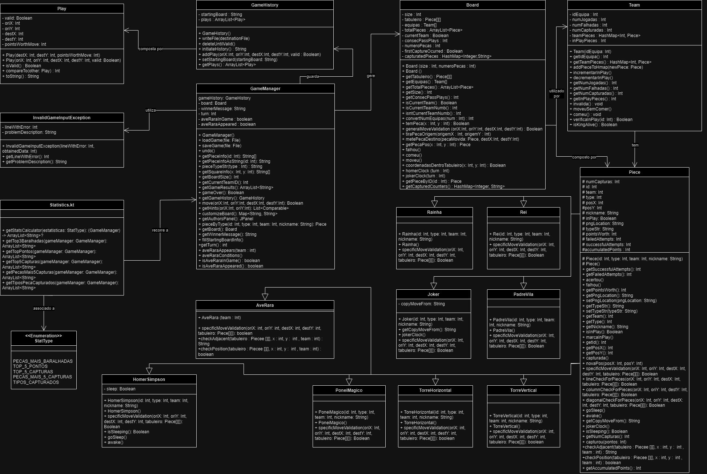

# Middle Earth Chess

O jogo de xadrez desenvolvido pelo grupo teve inspiração na saga
de [J.R.R.Tolkien](https://en.wikipedia.org/wiki/J._R._R._Tolkien), O Senhor dos Anéis.

Do lado das peças pretas, joga o lado do mal onde o olho de Sauron toma a posição de Rei e,
do lado das peças brancas, temos o dito lado do bem no qual Aragorn ocupa toma também a posição de Rei.

Para tal, recorremos às seguintes imagens :

<table>
  <tr>
    <td align="center" colspan="2">Rei</td>
  </tr>
  <tr>
    <td align="center">Sauron</td>
    <td align="center">Aragorn</td>
  </tr>
  <tr>
    <td align="center"></td>
    <td align="center"></td>
  </tr>
</table>

  

Nas entregas seguintes esta tabela contiuará a ser preenchida com outras personagens da
saga que corresponderam a diferentes tipos de peças.

# Diagrama UML

  

No desenvolvimento do nosso código tentámos ao máximo seguir o princípio do encapsulamento de modo que o código seja
facilemtne legível. Os nomes escolhidos para as funções são auto-explicativos de modo a garantir que seja facilmente
compreensível o que é que cada método faz.

Dado que todo o jogo se passa no tabuleiro, a classe Board é de maior importância, sendo nesta onde estão a maioria dos
métodos que complementam os métodos da classe GameManager. Esta classe contém uma matriz bidimensional (de objetos da
classe Piece) que representa o tabuleiro. Este irá guardar as peças nas posições respetivas e, no caso de não haver
peça, a posição terá o valor null. Guarda também a informação de que equipa deve jogar através de um boolean, false para
a equipa preta, true para a equipa branca, sendo depois retornado os respetivos valores de 0 ou 1 quando necessários nos
métodos da classe GameManager.

Nos objetos da classe Team apenas guardamos informação necessária aos métodos gameOver e getGameResults da gameManager
bem como as peças referentes a cada equipa.

No fim da "cadeia", temos a classe Piece implementada para que possamos criar objetos referentes a cada peça presente no
ficheiro/tabuleiro e guardar a sua informação respetiva de forma a que seja facilmente acessível.

Trabalho desenvolvido por [Miguel Melo](https://github.com/miguel-melo-a21905215) (21905215)
e [Gonçalo Barata](https://github.com/goncalo-barata-a22205060) (22205060)
